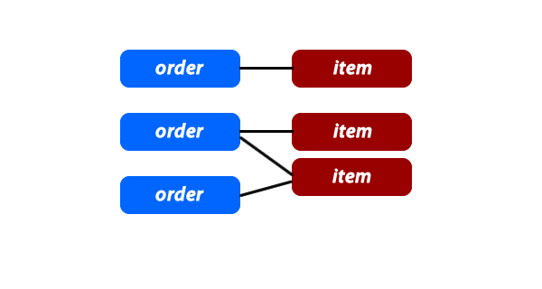
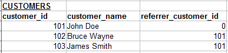
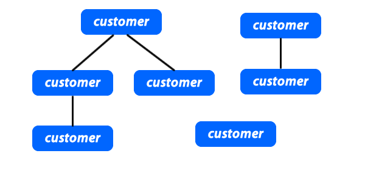

# Basics

## One to Many (O2M) and Many to One (M2O) Relationships

This is the most commonly used type of relationship. Consider an e-commerce website, with the following:

* Customers can make many orders.
* Orders can contain many items.
* Items can have descriptions in many languages.

In these cases we would need to create "One to Many" relationships. Here is an example:

Each customer may have zero, one or multiple orders. But an order can belong to only one customer.

## Many to Many Relationships (M2M)

In some cases, you may need multiple instances on both sides of the relationship. For example, each order can contain multiple items. And each item can also be in multiple orders.

For these relationships, we need to create an extra table:

The `items_orders` table has only one purpose, and that is to create a "Many to Many" relationship between the items and the orders. In M2M relationship we need always a `joint table` to connect the two tables that need M2M relationship between them.

Here is a how we can visualize this kind of relationship:

If you want to include the `items_orders` records in the graph, it may look like this:

## Self Referencing Relationships

This is used when a table needs to have a relationship with itself. For example, let's say you have a referral program. Customers can refer other customers to your shopping website. The table may look like this:

Customers 102 and 103 were referred by the customer 101.

This actually can also be similar to "one to many" relationship since one customer can refer multiple customers. Also it can be visualized like a tree structure:

One customer might refer zero, one or multiple customers. Each customer can be referred by only one customer, or none at all.

If you would like to create a self referencing "many to many" relationship, you would need an extra table like just like we talked about in the last section.