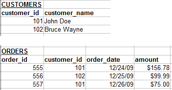
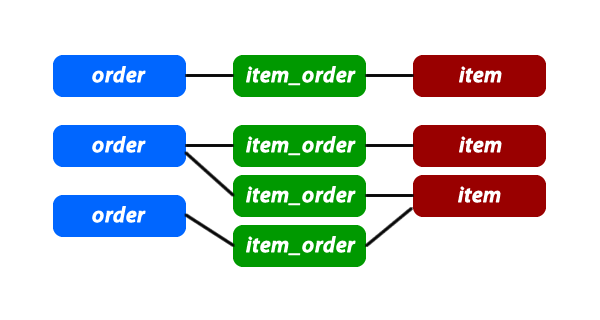

# Basics

## One to Many (O2M) and Many to One (M2O) Relationships

This is the most commonly used type of relationship. Consider an e-commerce website, with the following:

* Customers can make many orders.
* Orders can contain many items.
* Items can have descriptions in many languages.

In these cases we would need to create "One to Many" relationships. Here is an example:

Each customer may have zero, one or multiple orders. But an order can belong to only one customer.

## Many to Many Relationships (M2M)

In some cases, you may need multiple instances on both sides of the relationship. For example, each order can contain multiple items. And each item can also be in multiple orders.

For these relationships, we need to create an extra table:

The `items_orders` table has only one purpose, and that is to create a "Many to Many" relationship between the items and the orders. In M2M relationship we need always a `joint table` to connect the two tables that need M2M relationship between them.

Here is a how we can visualize this kind of relationship:

If you want to include the `items_orders` records in the graph, it may look like this:

