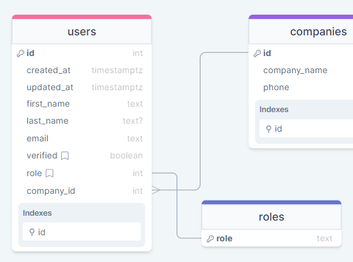
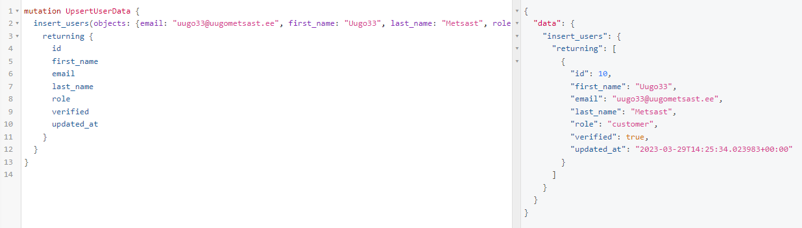
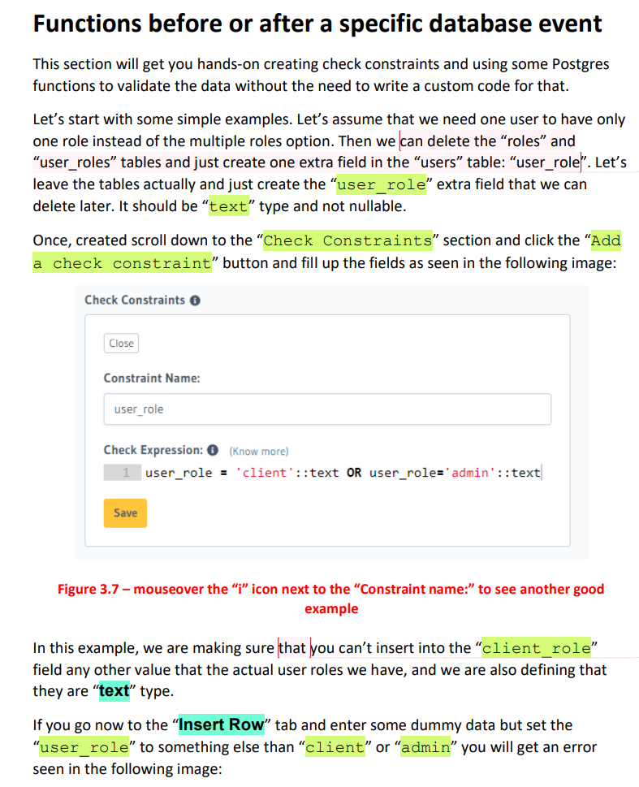
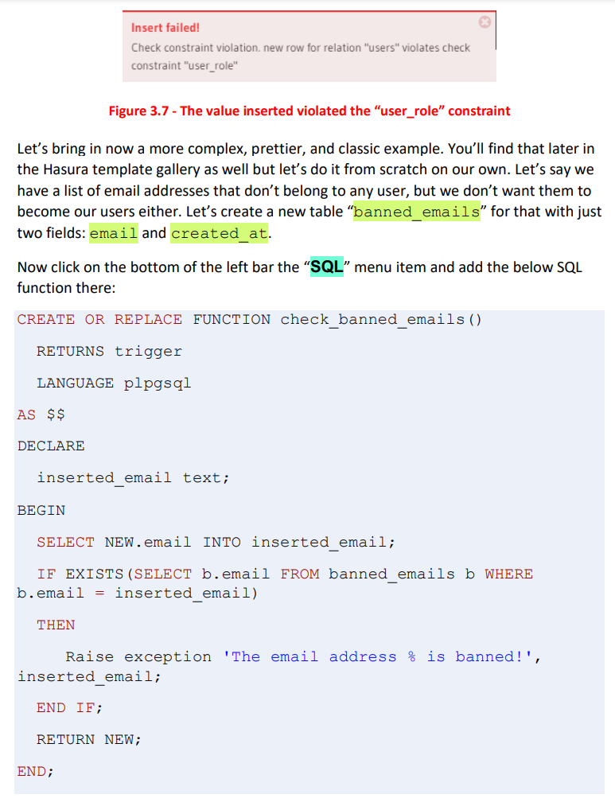
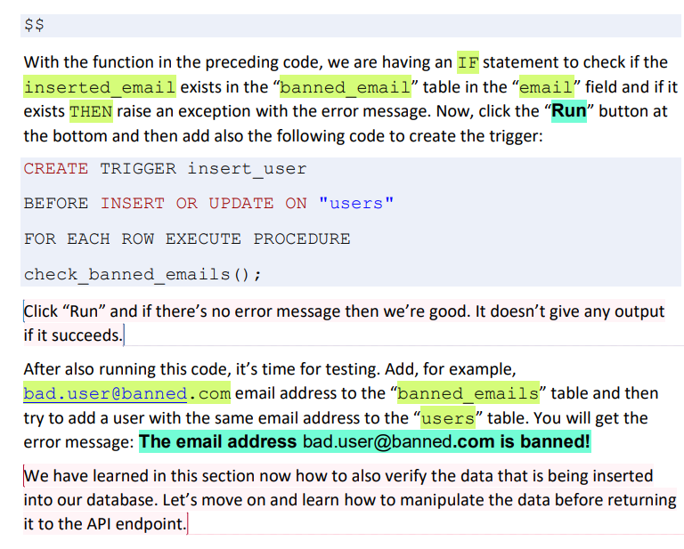

# 03 - Lesson

## Homework check
### 1. As a admin, I want to get the total amount of all invoices for a specific company. I want to be able to find the company by  remembering just part of its name.


What's wrong here? You count for each company the invoices so you need to do some math in frontend. You should start your query with `invoices_aggregate` and then there do the where company name `iregex` or `ilike` that is more logical as case in-sensitive but it would been correct also with `regex` and `like` (case sensitive) as the user story doesn't state it must be case in-sensitive.

I didn't send it back to Ilja because it is my fault that I didn't define that the queries must be built in a most efficient way so that there's no math needed in the front-end if possible. Also, doing one query only if possible instead of multiple. How we could do the same thing with multiple queries? First query all the company `id`'s that match the search pattern and then build a new query in the front-end and query the count of invoices for those companies and then reach to the point where Ilja's work was - sum up.

Here's a correct answer:


Note: using `ilike` instead that is also correct but I'd prefer also `iregex` like Ilja did because you want to have your queries maximum re-usable and Regex gives surely more options without the change of the query. Why universal queries are better? Well, because then you have to make less changes in your front-end (= less chances to mess something up) or for example when you use the query for REST API then you have to create less REST API endpoints.

### Previous homework

Note2: compare my naming to Ilja naming. Do you understand why some queries are better? Rise hands who watched at least half of the first homework? What did Uncle Bob say there?

PS. What videos do you wach from YouTube?

### 2. As an admin, I want to be able to mass delete bookings for a specific room between specific date range.

[](images/Homework%202%20-%20Ilja%20almost%20correct%20answer.png)

What's wrong here? Again, I can't call it wrong because I wasn't precise enough with my user story. But from an experienced developer I would expect to understand what I mean. Obviously I wouldn't care as a user when the booking was created. I most probably want to get rid of the booking for some room that was booked between some dates. Maybe some super important thing came in so everybody shall be cancelled or it needs to go to renovation. Of course, then there must be some other actions too: inform everybody, say sorry, issue refund, issue discount to book another room, etc. Try to think always what could be the use-case. People doesn't give precise user stories and will tell you "there's a bug" at one moment and then you go nuts trying to understand "hat the heck!!!!". Tiny details. Detail orientation is all about development! Correct user story would end like this: "between specific date range **the room was booked**". So I would expect you to use `date` instead of `created_at`.


Note: `_and` in my query - it is actually not necessary and Ilja's works exactly the same but we will touch that topic today.

Note2: Better naming.

Note3: Returning some useful data. Here Ilja isn't wrong at all again. Affected rows is fine. Just say "Deleted 2 reservations" in the front-end but just bringing an example where we could say display the date and timeframe we just cleaned up for the room.

In my case I have used a timezone for the time `+01` that is central European time. Actually I like to use UK time mostly because I'm in Europe and work with other European people in Central and Western Europe so it makes easier for this use case. In Estonia at the moment is DST (daylight saving time) `+03` and in the winter `+02` and if I knew all the users are from the same timezone I would surely go with that timezone. In this example, correct is with timezone already because it is a physical room booking and that room is in a specific timezone.

I would use the timezone also when signing some contracts or any other legal reasons. Then we want to have the user's local timestamp with timezone.

At most cases, it is preferrable using UTC (Coordinated Universal Time) - letter Z at the end. Why?

Consistency! Always good thing! UTC ensures that you have a consistent time base, regardless of where your users are located. And easier to compare and sort timestamps. And it avoids potential issues with time zone differences. And daylight saving time changes. Pretty many advatages, right?

Also flexibility. By storing data in UTC, you can easily convert it to any other time zone when presenting it to users. Useful again for apps with users in multiple time zones or when users traveling between time zones.

## Relationships

### Repeat the super important FK (foreign key) in O2M
FK from the plural side (many side) to the PK (primary key) in the singular side.


### O2O


### Enum (enumerated)
Specific type of table that contains a predefined list of values. Enum tables are often used when you have a column that should only accept a limited number of distinct values. For example, a "status" column could have values like "pending", "approved", or "rejected". What else could be Eenum in our schema?

Create enum-roles (customer, vip, manager, worker):


Update data query: https://i.imgur.com/ih9ZKx1.png (well, actually you shall run at this case it for each role eg. 1 = customer, etc).

Create the foreign key. Which side? But don't go to the permissions. I show you another smart shortcut: `/console/data/default/schema/public`

Test it out. Get all the workers user data. https://i.imgur.com/iLhUWkC.png

## Predicate

When you use an aggregate functions like `count`, `average` etc. you can filter the results based on a condition(s) using the `predicate` property. 

### 3. As a marketing manager, I want to email some marketing stuff to all the users who haven't made any bookings.


Check `GPT` images under `/images` to see how I used the tool to get this done quick. Also, added at the bottom of the root README two cool URLs so you can DUDE your GTP and learn to use "prompts" and "acts". 

## `_and`, `_or` and `_not` operators

You can use `_and`, `_or` and `_not` operators between your conditions and let's bring a complex example: 

(field1 = "value1" 
  AND 
  (field2 = "value2" 
    OR 
    field3 = "value3"
    )
  ) 
AND 
(field4 ≠ "value4")

```
where: {
  _and: [
    {
      field1: {_eq: "value1"},
      _or: {
        field2: {_eq: "value2"},
        field3: {_eq: "value3"}
      }
    },
    {
      _not: {
        field4: {_eq: "value4"}
      }
    }
  ]
}
```

## Violation

From the [book](https://crnw.uk/hasurali):

`Restrict` is the Hasura’s default option as the name says it restricts you, for example, update or delete the role “customer” if there is at least one user with that role. Most probably it is fine when deleting because when someone by mistake tries to delete the `customer` role we will want to prevent it if some users have that role. 

`No action` is pretty much the same. You can not delete the `customer` role. There will be no (delete) action when you try to delete. The difference really is when the check is made `restrict` will check in the beginning and `no action` at the end. So do you want the whole query fail or do you want everything happen and just the constrait violation to fail?

When we update the name of the `customer` role for example to `customer_vip` then with the `cascade` option all the users with the `customer` role will become `customer_vip`. In case of delete it is dangerous because when we delete the `customer` role from the enum table, all the users with that role will be deleted. 

Well, we might want that in some situations but remember that the `cascade` is the most dangerous one when it comes to deleting.

`set null` and `set default` are the easiest to understand probably as on deletion or updating the `customer` role all the users will either have their role NULL or set to default.

Delete cascade makes sense sometimes, too: when you delete the user then you may want to also delete all the reviews made by the user but hell no all the invoices from the accounting😄

## Upsert

It is an insert mutation with on_conflict argument that will first check if there’s no conflict with another row in the table. If there is any conflict then it will instead of inserting a new record, update the existing one or ignore the request.

Example: Insert a new object in the `article` table or, if the unique constraint `article_title_key` is violated, update the `content` and `title` columns of the existing article:

```
mutation UpsertArticle {
  insert_article (
    objects: [
      {
        title: "Article name",
        content: "Updated article 1 content",
        published_on: "2022-10-12"
      }
    ],
    on_conflict: {
      constraint: article_title_key,
      update_columns: [content, title]
    }
  ) {
    returning {
      id
      title
      content
      published_on
    }
  }
}
```

Now make yourself a query where we inser some user data and if the email address exists then update the user.



## User story 1: As a customer I want to add reviews for the rooms

Need to makse some changes in the database but first, please help your customer to properly write this user story. We need probably:

1. Can add review only if has a booking
2. The booking shall be in the past
3. There shall be no reviews already for this booking
4. What type(s) the review will have? I can suggest for example: "text" (max. 1024 chars) and "integer" (1-5) that I would call `rating_stars`. You may want to add also "title" for the review and many other parameters like separately rate "cleanness" and/or any other parameters. Ask GPT if you run out of ideas but want to make it super complex😊
5. Should the review be left in behalf of the company or the user? Company will be "cheaper" as we can use O2O.

Now, go and make the DB changes. First let's draw in the whiteboard, how to add it into [our existing ER diagram](https://i.imgur.com/nmZBsXN.png).

[Final result](images/Relationships-4-Add-O2O-reviews.png)

Now, like always, add some test data.

## SQL Functions & Constraints

Create a constraint in the `reviews` table: `rating_stars::numeric > 0::numeric AND rating_stars::numeric < 6::numeric`





1. Create `banned_emails` table with `id`, `email` and `created_at` columns.
2. Paste into SQL: [CheckBannedEmail.sql](./CheckBannedEmail.sql) and run to create the SQL function: https://i.imgur.com/HqtCUzZ.png Remember, you can always create complex functions like that with the help of Google & GPT.
3. Paste into SQL: [CreateTrigger.sql](./CreateTrigger.sql) and run, to trigger the previously added function. Slightly simpler code. Read the comments of both codes generated by GPT. Use always GPT to explain the code. If it's hard to understand, then say "explain it more simple way" or something.  
4. Ban yoursself. And then try to signup and see the error: https://i.imgur.com/ZRY1wtV.png

## Hints
* Play button at GraphiQL can execute only one query if you have multiple there