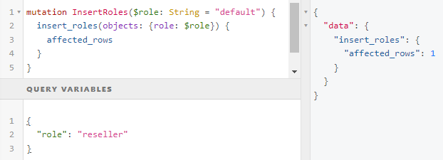
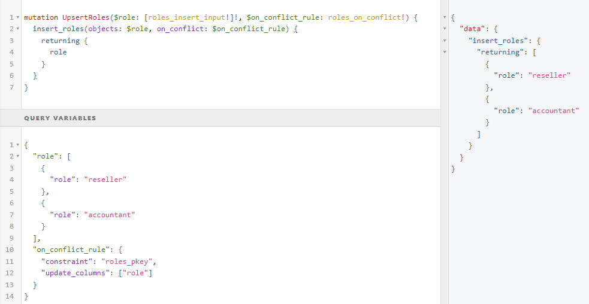

# Lesson 4

## Test

SQL relations, GraphQL - Basic queries with pen and paper. Simple stuff. But you don't have the GraphiQL nor internet. And Uncle Bob's first part: what did he say with few words.

## Let's finish with check constraints

Email addresses: `char_length(email) >= 5 AND char_length(email) <= 255 AND position('@' in email) > 1 AND position('.' in substring(email from position('@' in email) for 255)) > 1` - email length is between 5 and 255 characters, contains an '@' symbol, and contains a period '.' after the '@' symbol. 

Phone number: `char_length(mobile_number) >= 7 AND mobile_number ~ '^[\d\-\+\(\)]+$'` - at least 7 characters long and contains only digits and the specified symbols `(`, `)`, `-` and `+`. 

## Hasura CLI (command line interface) 

1. Install Hasura CLI:

Console is GUI (graphical user interface). Now [download the latest version of the Hasura CLI](https://github.com/hasura/graphql-engine/releases). Scoll down and find under the assets: https://i.imgur.com/KmjgZV4.png On Windows save the file in the root folder where you keep your repos in your computer as `hasura.exe`

On UNIX terminal:

`curl -L https://github.com/hasura/graphql-engine/raw/stable/cli/get.sh | INSTALL_PATH=/usr/local/bin bash`

2. Set up a new Hasura project:

To create a new Hasura project, open a terminal, navigate to your desired directory, and run the following command: `hasura init cloud-services-hasura`

This will create a new directory called `cloud-services-hasura` with the necessary configuration files.

3. Create [.gitignore](https://github.com/crewnew-git/cloud-services-backend/blob/main/.gitignore) file

4. Move `config.yml` away from the folder temporarily, create a repo from the folder & commit/puh. Add the configuration file back.

5. Configure your Hasura project:

Open the folder in VSCode. CD to it and `code .`. Open the `config.yaml` file in your favorite text editor and update it according to [../hasura/config.yaml](../hasura/config.yaml)

NOTE: If not Cloud, then endpoint must end with `/v1/graphql` of course!!! Hasura CLI requires the root endpoint of the Hasura Cloud project without the /v1/graphql path. WEIRD!

4. Run Hasura console:

Run the following command from the project directory in VSCode: `hasura console` or if you are allowed to work in production environment (or dev environment in server) you can `hasura console --endpoint "https://cloud-services.hasura.app" --admin-secret "your-secret-here"`

1. `hasura metadata export`

This command will export the metadata and create a metadata directory inside your Hasura project folder with files like `tables.yaml` or `query_collections.yaml`/`rest_endpoints.yaml` with REST queries, [relations/permissions](https://github.com/crewnew-git/cloud-services-backend/blob/main/metadata/databases/default/tables/public_rooms.yaml) etc., depending on the features you've used in your Hasura instance. To see the status: `hasura migrate status`

6. To export the migrations, run the following command:

`hasura migrate create <migration_name> --from-server`(name, eg.`init`)

This command will create a new folder inside the migrations directory with the given migration name and a timestamp/version. The folder will contain two files: up.sql and down.sql, representing the forward and backward migration steps, respectively. Initial one won't have down.

7. Commit/push
8. Modify your schema using the localhost Hasura console
9. Commit/push. Now you should see and track changes: https://github.com/crewnew-git/cloud-services-backend/commit/4325bcb5c54e01c92f45e57f5198ed9b58df8595
10. Once imaginary co-workers have approved, they will:

`hasura deploy` or `hasura deploy --with-seeds` if seends needed to be deployed, too. This command does two things: `hasura metadata apply` and `hasura migrate apply`

If you see the message "nothing to apply on database: default" even though there are new migrations in your migrations directory, it's possible that the migration status is out of sync between your local Hasura project and your Hasura instance.

Reset the migrations on your Hasura instance: `hasura migrate apply --down all` This command will undo all applied migrations on your Hasura instance. Be careful when using this command, as it may result in data loss or schema changes.

Apply the migrations again: `hasura migrate apply` This command should now apply all migrations in your migrations directory, including the new changes.

`hasura metadata diff` - shows changes between two different sets of Hasura Metadata. By default, it shows changes between the exported Hasura Metadata and the Hasura Metadata on the server.

Problems with inconsistent metadata? This command, when used with subcommands, can be used to manage inconsistent objects in Hasura metadata. Options include: `hasura metadata inconsistency list`, `hasura metadata inconsistency delete`, `hasura metadata inconsistency status`, `hasura metadata reload` and hasura `metadata inconsistency drop`

### hasura migrate squash

If you have a lot of migrations that you want to squash into a single one:

`hasura migrate squash --name "<name>" --from 1680098627629 -to 1680116894316` - if you want 'em all do not use `-to`

[Squash documentation](https://hasura.io/docs/latest/hasura-cli/commands/hasura_migrate_squash/) and [All CLI commands doc](https://hasura.io/docs/latest/hasura-cli/commands/index/).

### Issues to solve problems you have generated

Created some mess? Want to delete the crap you generated but getting errors? Stuck? Then try to delete also the test data first. Or if production export it to re-import later. Then delete under "Relationships" the relationships. Also do the same from the related tables. Then  delete the foreign keys. If it didn't fix the issue then you can also delete the table. If deletion of things fails then from the top right menu click "Settings" and open `/console/settings/metadata-actions` and https://i.imgur.com/EQwutFJ.png

## Tempate galery

To see the available templates in the gallery and to load them just click on the “default” schema name in the left panel under the “Data” from the top menu and you will see the list of templates. Just click on the template name and you will see more information about it including the image and all the SQL statements that will be run. You have also a link to the GitHub repo to see all the code.

To check the template out in the action, just click on the “Install template” button. You can find the full template gallery on Hasura’s GitHub page here: https://github.com/hasura/template-gallery

## TypeSafety & Variables

## Computed Fields

See under images.