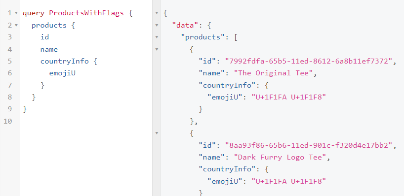

# Lesson 9

## Payment method with Hasura Actions

Demo

## Remote Schemas

Deploy a sample Hasura e-shop and compare it to yours: https://cloud.hasura.io/deploy?github_repo=https://github.com/hasura/docs-sample-app&hasura_dir=/

Click "Add" under REMOTE SCHEMAS and:

Name: `countries_api`
GraphQL Service URL: `https://countries.trevorblades.com/graphql`

Create relationship:

Open `products` table's "Relationships" tab and at the bottom click "Add Relationship". Call it eg. `countryInfo` and from "To Reference" dropdown pick `countries_api` then under "Relationship Details" under `country`->`code` make the "From Field" as `country_of_origin`:

Test it out and get the flag emoji with the product data:

PS. The `U+1F1FA U+1F1F8` will display as a US flag if you using "Unicode Character Code": `
&#x1F1FA;&#x1F1F8;
`

You can the same way now use all the World's countries data in your remote schema.

We now connected a remote GraphQL API to our Hasura GraphQL schema and created a relationship between our existing data model and the remote GraphQL API. So, we can query data from both APIs in a single query, and also use the data from the remote API to filter or augment our existing data model🚀

Some GraphQL APIs I've been using:
* #1 of course - build my own custom business logic and create it as a GraphQL endpoint
* #2 - connect to some other own or partner's service via GraphQL. Eg. accounting, sales, CRM etc. foftwares. Of course, if they don't have GraphQL - I'll have to create a custom action and connect to their REST API and if they don't have any API at all then I may be able to get their database access and connect their database directly to my Hasura.
* [GraphLoc](https://graphloc.com/) to find out the geographic location of the visitor. Eg. sometimes some services available only for certain countries or want to provide personalised content regarding the user location. Well, we can also use the browser language but very often we want to know also from where physically the user comes from.
* [Canopy](https://www.canopyapi.co/) - get from Amazon product data to display in the website for some affiliate cash for the site owner. Also, [EAN Search](https://www.ean-search.org/) to search barcodes/products.
* [Github GraphQL](https://rapidapi.com/rapidapi/api/github-graphql2/). Also, GitLab has a GraphQL API available.

## Multi-tenancy

Chapter 12

## Using GraphQL aliases

In the following query, we are first fetching all the books. Then we fetch the cheapest books and finally, we fetch the most expensive book. Instead of writing three different queries we want to write one query for efficiency but if we will have three "books" queries in one query we will get an error due to the field names clash. So we can use aliases like this:

## Break long queries into multiple sets with fragments

Example: get all the books but also, we want to get the cheapest book in our store. We want some fields about the books, in the following example, the id, title and price. In this case, we can use reusable units that are called fragments in GraphQL. Fragments let us construct sets of fields and then include them in queries where we need them. In the following example, you can see that we are re-using the booksFields fragment. This is a small example, and we don’t see a big win here but imagine if you have tons of fields and bigger nested queries then things can get quickly messy, and fragments are the solution here.

You can also use variables in the fragments and make the query that way also dynamic and re-usable😉