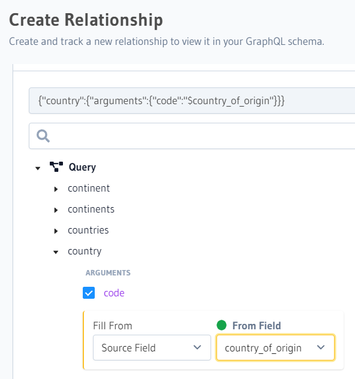

# Lesson 9

## Payment method with Hasura Actions

Demo

## Remote Schemas

Deploy a sample Hasura e-shop and compare it to yours: https://cloud.hasura.io/deploy?github_repo=https://github.com/hasura/docs-sample-app&hasura_dir=/

Click "Add" under REMOTE SCHEMAS and:

Name: `countries_api`
GraphQL Service URL: `https://countries.trevorblades.com/graphql`

Create relationship:

Open `products` table's "Relationships" tab and at the bottom click "Add a remote schema relationship". Call it eg. `countryInfo` and from "Remote schema" dropdown pick `countries_api`:



Test it out:

```
query {
  products {
		id
		name
    countryInfo {
      emoji
    }
  }
}
```

We now connected a remote GraphQL API to our Hasura GraphQL schema and created a relationship between our existing data model and the remote GraphQL API. So, we can query data from both APIs in a single query, and also use the data from the remote API to filter or augment our existing data model🚀

## Multi-tenancy

Chapter 12

## Using GraphQL aliases

In the following query, we are first fetching all the books. Then we fetch the cheapest books and finally, we fetch the most expensive book. Instead of writing three different queries we want to write one query for efficiency but if we will have three "books" queries in one query we will get an error due to the field names clash. So we can use aliases like this:


## Break long queries into multiple sets with fragments

Example: get all the books but also, we want to get the cheapest book in our store. We want some fields about the books, in the following example, the id, title and price. In this case, we can use reusable units that are called fragments in GraphQL. Fragments let us construct sets of fields and then include them in queries where we need them. In the following example, you can see that we are re-using the booksFields fragment. This is a small example, and we don’t see a big win here but imagine if you have tons of fields and bigger nested queries then things can get quickly messy, and fragments are the solution here.


You can also use variables in the fragments and make the query that way also dynamic and re-usable😉